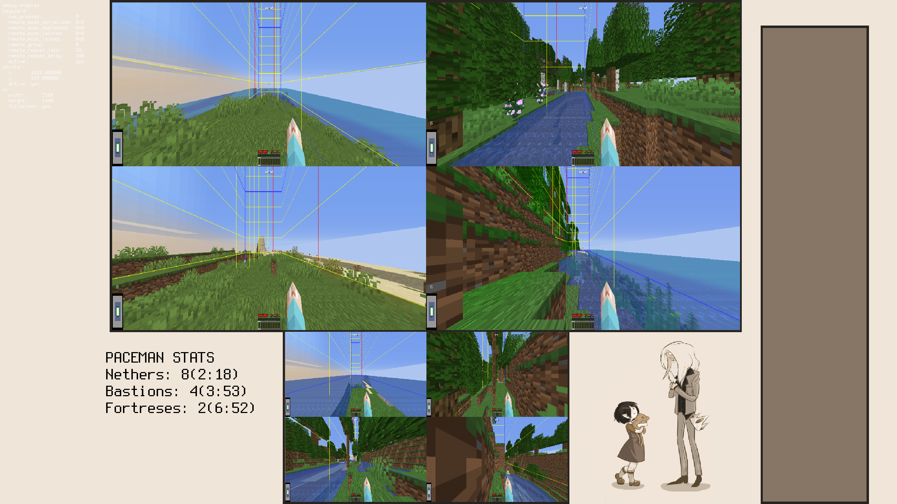

# Waywall Paceman Overlay

A paceman stat overlay for [Waywall](https://github.com/tesselslate/waywall)

---

## Installation
- Clone the repository into your waywall config folder
```bash
cd ~/.config/waywall
git clone https://github.com/arjuncgore/waywall_paceman_overlay.git
```
- Install `luarocks` using your package manager (this is also a waywall dependency and should already by installed on your system)
  - `sudo dnf install luarocks` on Fedora
  - `sudo apt-get install luarocks` on Debian/Ubuntu
  - `sudo pacman -S luarocks` on Arch
- Install `luasec` with luarocks
  - `sudo luarocks --lua-version=5.1 install luasec`
---

## Setup
### 1. Import the module

Add this line to your `init.lua` **before your `config.actions` section**:

```lua
local nb_overlay = require("waywall_ninbot_overlay.nb_overlay")
```

### 2. Add keybindings

Add these binds to `config.actions`:

```lua
["*-C"] = function()
  if waywall.get_key("F3") then
    waywall.press_key("C")
    waywall.sleep(200)
    nb_overlay.enable_overlay()
  else
    return false
  end
end,

["<any key>"] = nb_overlay.disable_overlay,
```
> Replace `<any key>` with your preferred key for disabling the overlay.
**Do not change the key for `enable_overlay`** — it is designed to be triggered with `F3 + C` to ensure the overlay updates in sync with Minecraft.
---

## Customization

### Overlay text appearance
Edit the `look` table in `nb_overlay.lua` to change the text's position, color, size, and boldness:

```lua
local look = {
    X = 500,
    Y = 10,
    color = '#000000',
    size = 2,
    bold = true,
}
```

### Background image
Replace `nb_background.png` with your own image.  

- It will be **automatically resized** to fit the overlay
- It's suggested to use a **solid color or minimal texture** — other pictures may look distorted when stretched

---
## Preview
<p align="center">
  
</p>
*Example overlay showing Nether travel prediction*

---

## Credits

- **Tesselslate** – creator of the original Waywall
- **Arsoniv** – developer of the Waywall fork with HTTP support (inspired the original version of this overlay)
- **Ninjabrain** – creator of Ninjabrain bot
- **David Heiko Kolf and others** - creator of the json lua library https://github.com/LuaDist/dkjson
- **Jakob Green** - creator of the requests lua library https://github.com/JakobGreen/lua-requests

---
